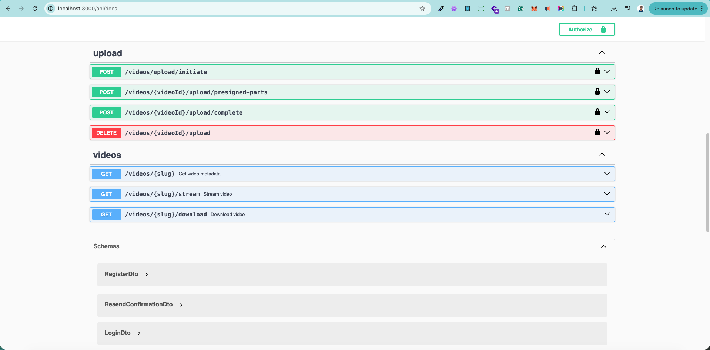
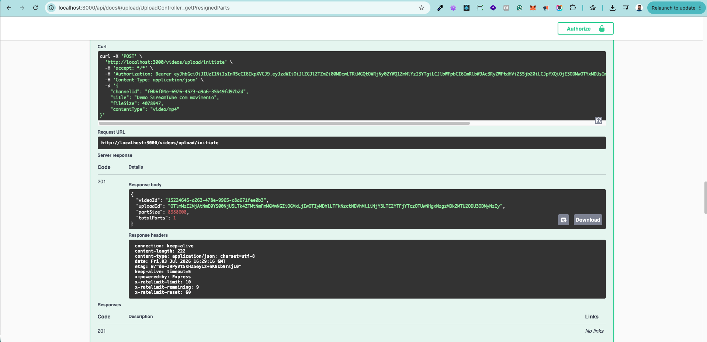
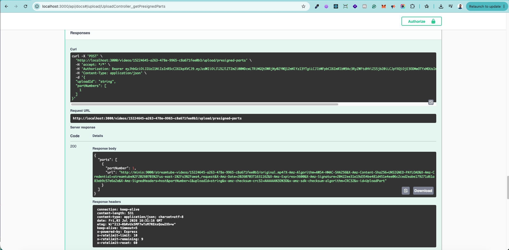

# StreamTube — Plataforma de Compartilhamento de Vídeos

Projeto da disciplina **Desenvolvimento de Aplicações de IA** do MBA de Engenharia de Software com IA da [Full Cycle](https://fullcycle.com.br).

Este é um projeto greenfield desenvolvido para demonstrar como construir uma aplicação do zero utilizando IA de forma adequada no processo de desenvolvimento.

## Professor

<a href="https://github.com/argentinaluiz">
    
    <br />
    <sub>
        <b>Luiz Carlos</b>
    </sub>
</a>

---

## Quadro Branco

- [Quadro Branco](./whiteboard.png)

---

## 🎨 Design System (Figma)

- [FC Tube.fig](./FC%20Tube.fig) — arquivo-fonte do **design system** do projeto no Figma.

Contém os fundamentos visuais do StreamTube — tokens (cores, tipografia, espaçamento, raios), componentes e as telas da plataforma. É a referência de design para a implementação do frontend: os componentes em `next-frontend/components/ui` (shadcn) e os tokens em `next-frontend/app/globals.css` derivam deste arquivo. Abra-o no Figma (`Arquivo → Importar`) para consultar especificações e estados visuais.

---

## 📋 Pré-requisitos

- Docker e Docker Compose
- Node.js v25+ (para rodar os testes E2E do Playwright no host)
- npm

## 🏗️ Arquitetura

O projeto é um monorepo baseado em containers Docker. Cada subprojeto sobe sua própria stack via `docker compose`.

- **Frontend** (Next.js 16, App Router + React Server Components) — interface da plataforma. Segue o **modelo BFF**: o navegador nunca chama a API NestJS diretamente; todo tráfego passa por Route Handlers same-origin em `app/api/**`, que fazem proxy server-side para a API.
- **API** (NestJS 11) — regras de negócio, autenticação (JWT + refresh token rotation), envio de e-mails e acesso ao banco.
- **Database** (PostgreSQL 17) — usuários, canais e tokens de autenticação.
- **Email Service** (Mailpit) — captura os e-mails transacionais (confirmação de conta e recuperação de senha) em uma UI local.
- **Object Storage** (MinIO/S3-compatible) — armazena arquivos de vídeo e thumbnails; upload multipart via presigned URLs.
- **Message Queue** (Redis + BullMQ) — fila `video-processing` para tarefas assíncronas de transcodagem.
- **Video Worker** (NestJS standalone + FFmpeg) — consome jobs da fila, executa ffprobe → faststart remux (`-c copy`) → thumbnail → upload para MinIO → atualiza status no banco.

O diagrama de arquitetura completo (C4) está em `docs/diagrams/software-arch.mermaid`.

## 🚀 Como rodar

Os dois subprojetos têm stacks Docker **separadas**. Suba primeiro o backend, rode as migrations e depois o frontend.

### 1. Backend (NestJS + PostgreSQL + MinIO + Redis + Mailpit)

```bash
cd nestjs-project

# Sobe API, banco, MinIO, Redis e Mailpit
docker compose up -d

# Instala dependências (apenas na primeira vez)
docker compose exec nestjs-api npm install

# Cria o schema do banco (obrigatório — synchronize está desabilitado)
docker compose exec nestjs-api npm run migration:run

# Sobe o servidor de desenvolvimento em watch mode
docker compose exec -d nestjs-api npm run start:dev

# (opcional) Sobe também o worker de vídeo
docker compose --profile worker up -d
```

Serviços disponíveis:

| Serviço | URL / Porta |
|---------|-------------|
| API NestJS | http://localhost:3000 |
| PostgreSQL | `localhost:5432` (db/user/senha: `streamtube`) |
| MinIO (Object Storage) | interno — sem porta exposta; healthcheck via `mc ready local` |
| Redis | interno — sem porta exposta; healthcheck via `redis-cli ping` |
| Mailpit (UI de e-mails) | http://localhost:8025 |
| Swagger (opcional) | http://localhost:3000/api/docs — habilite com `SWAGGER_ENABLED=true` |

> MinIO e Redis não expõem portas no host para evitar conflitos. Toda comunicação é interna via rede Docker.

### 2. Frontend (Next.js)

```bash
cd next-frontend

# Garanta que o .env.local existe (veja .env.example)
# API_URL aponta para o backend; SESSION_PASSWORD protege a sessão (iron-session)

docker compose up -d
docker compose exec next-frontend npm install        # apenas na primeira vez
docker compose exec -d next-frontend npm run dev
```

A aplicação ficará disponível em **http://localhost:3001**.

> As stacks são separadas, então o frontend acessa o backend via `host.docker.internal:3000` (configurado em `next-frontend/.env.local` e no `extra_hosts` do compose).

## 🧪 Testes

### Backend (Jest)

```bash
cd nestjs-project
docker compose exec nestjs-api npm test               # unitários + integração
docker compose exec nestjs-api npm run test:e2e       # end-to-end (HTTP via supertest)
docker compose exec nestjs-api npm run test:cov       # cobertura
```

Sufixos: `*.spec.ts` (unitário), `*.integration-spec.ts` (integração com banco real), `*.e2e-spec.ts` (end-to-end). Testes de integração/e2e rodam com `--runInBand`.

### Frontend (Vitest + Playwright)

```bash
cd next-frontend
docker compose exec next-frontend npm test            # unitários + integração (Vitest + MSW)
npx playwright test                                   # end-to-end (no host, com dev server em MSW_ENABLED=true)
```

Sufixos: `*.test.ts(x)` (unitário), `*.integration.test.ts(x)` (Route Handlers com MSW), `*.e2e-spec.ts` (Playwright). MSW intercepta as chamadas à API NestJS — os testes nunca batem no backend real.

## ✅ Funcionalidades implementadas

**Fase 01 — Configuração base**, **Fase 02 — Autenticação** e **Fase 03 — Upload e Processamento de Vídeos** estão concluídas (backend).

### Autenticação (Fase 02)

Fluxo completo de **cadastro → confirmação por e-mail → login → recuperação de senha**, com canal criado automaticamente para cada usuário (a partir do prefixo do e-mail).

Endpoints da API (`nestjs-project`):

| Método & Rota | Descrição |
|---------------|-----------|
| `POST /auth/register` | Cadastro de usuário (cria usuário + canal) |
| `GET /auth/confirm-email?token=` | Confirmação de conta via link do e-mail |
| `POST /auth/resend-confirmation` | Reenvio do e-mail de confirmação |
| `POST /auth/login` | Login (retorna access + refresh token) |
| `POST /auth/refresh` | Rotação de refresh token (com family + grace period) |
| `POST /auth/logout` | Revoga os refresh tokens da sessão |
| `POST /auth/forgot-password` | Solicita e-mail de recuperação de senha |
| `POST /auth/reset-password` | Redefine a senha via token |
| `GET /auth/me` | Dados do usuário autenticado (protegido por JWT) |

Telas e Route Handlers BFF (`next-frontend`):

- `/(auth)/signup`, `/(auth)/login`, `/(auth)/forgot-password` — formulários com React Hook Form + Zod e validação inline.
- `app/api/auth/{signup,login,logout,forgot-password}` — proxy same-origin para a API.

Segurança: senhas com **Argon2**, **JWT** com `JwtAuthGuard` global (opt-out via `@Public()`), **rotação de refresh token** com detecção de reuso, **rate limiting** (`ThrottlerGuard`) nos endpoints de auth, e sessão no navegador via **iron-session** (cookies HTTP-only).

### Canais e Vídeos (Fase 03 — concluída)

Fluxo completo de **upload multipart → processamento assíncrono → streaming**, do rascunho ao vídeo pronto para assistir.

#### Infra e domínio

| Componente | O que faz |
|------------|-----------|
| `POST /channels` | Cria canal para usuário autenticado com slug gerado automaticamente |
| Docker Compose (MinIO + Redis + worker) | Object storage, broker de filas e worker de vídeo no ambiente de desenvolvimento (worker via `--profile worker`) |
| `StorageModule` | `S3Client` configurado para MinIO com `forcePathStyle`; `StorageService` expõe upload multipart (initiate / presigned-part / complete / abort), `putObject` (streaming via `@aws-sdk/lib-storage`), `getObjectStream` com Range Requests e `generatePresignedGetUrl` |
| `QueueModule` | `BullModule` configurado com Redis via `forRootAsync`; fila `video-processing` disponível para injeção via `@InjectQueue('video-processing')` |
| `VideosModule` / `VideosService` | Entidade `Video` (status enum, slug URL-safe de 11 chars, FK para canal, coluna jsonb `metadata`, `duration_seconds`, `storage_key`, `thumbnail_key`); `VideosService` expõe criação de rascunho, busca por id/slug, atualização de status, `updateAfterProcessing`, `getPublicVideoBySlug` e `getReadyVideoBySlug` |

#### API de upload

| Método & Rota | Descrição |
|---------------|-----------|
| `POST /videos/upload/initiate` | Cria rascunho + inicia multipart no MinIO; retorna `videoId` e `uploadId` |
| `POST /videos/:id/upload/presigned-parts` | Gera URLs pré-assinadas para cada parte do upload |
| `POST /videos/:id/upload/complete` | Finaliza o multipart e enfileira job de processamento |
| `DELETE /videos/:id/upload/abort` | Aborta o multipart e remove o rascunho |

#### API de vídeos

| Método & Rota | Descrição |
|---------------|-----------|
| `GET /videos/:slug` | Metadados do vídeo (anônimo OK; não-prontos visíveis só para o dono) |
| `GET /videos/:slug/stream` | Streaming do vídeo com suporte a `Range` (206 Partial Content) |
| `GET /videos/:slug/download` | Download direto via presigned URL |

#### Worker de vídeo (NestJS standalone + FFmpeg)

Aplicação `NestFactory.createApplicationContext(WorkerModule)` que consome jobs `'video.process'` da fila:

1. Download do arquivo bruto do MinIO para disco temporário
2. `ffprobe` — extrai duração, codec, dimensões
3. Faststart remux com `-c copy` (sem re-encode — move átomos moov para o início)
4. `ffmpeg screenshots` — gera thumbnail a 50% do vídeo
5. Upload do vídeo processado e thumbnail para MinIO
6. `updateAfterProcessing` — grava status READY + metadados no banco

## ✔️ Validação da Fase 03 — Fluxo completo executado

O fluxo de upload → processamento → streaming foi executado e validado de ponta a ponta:

| Etapa | Endpoint / Componente | Resultado |
|-------|-----------------------|-----------|
| Login | `POST /auth/login` | ✅ Token JWT gerado |
| Iniciar upload | `POST /videos/upload/initiate` | ✅ `videoId` + `uploadId` criados; vídeo com `status: draft` |
| URL pré-assinada | `POST /videos/:id/upload/presigned-parts` | ✅ Presigned URL válida para PUT no MinIO |
| Upload para MinIO | PUT direto (presigned URL, sem passar pela API) | ✅ `HTTP 200`, ETag retornado |
| Completar upload | `POST /videos/:id/upload/complete` | ✅ Job enfileirado; `status: processing` |
| Worker processou | BullMQ → `VideoProcessorConsumer` | ✅ `status: ready`; `durationSeconds: 10` |
| Metadados | `GET /videos/:slug` | ✅ Slug único, thumbnail URL gerada |
| Streaming | `GET /videos/:slug/stream` + `Range: bytes=0-4095` | ✅ `HTTP 206 Partial Content` |
| Download | `GET /videos/:slug/download` | ✅ `HTTP 200`, arquivo completo |

### Swagger UI — endpoints da Fase 03

Grupos **upload** (4 endpoints protegidos por JWT 🔒) e **videos** (3 endpoints públicos) visíveis em `http://localhost:3000/api/docs` com `SWAGGER_ENABLED=true`:



`POST /videos/upload/initiate` executado pelo Swagger com token Bearer — resposta `201` com `videoId` e `uploadId`:



`POST /videos/{videoId}/upload/presigned-parts` — resposta `200` com presigned URL do MinIO para PUT direto:



### Thumbnail gerada automaticamente pelo worker (FFmpeg a 50% do vídeo)


### Suite de testes — resultado final (2026-07-03)

**Unit + Integration** (`npm test -- --runInBand`):

```
PASS src/auth/auth.service.integration-spec.ts
PASS src/worker/video.processor.integration-spec.ts
PASS src/auth/auth.service.spec.ts
PASS src/openapi-export.integration-spec.ts
PASS src/mail/mail.service.integration-spec.ts
PASS src/auth/auth.module.spec.ts
PASS src/videos/video.entity.integration-spec.ts
PASS src/database/migrations.integration-spec.ts
PASS src/mail/mail.module.spec.ts
PASS src/channels/channels.module.spec.ts
PASS src/users/users.service.integration-spec.ts
PASS src/channels/channels.service.integration-spec.ts
PASS src/auth/entities/verification-token.entity.integration-spec.ts
PASS src/channels/entities/channel.entity.integration-spec.ts
PASS src/videos/upload/upload.service.spec.ts
PASS src/users/users.module.spec.ts
PASS src/storage/storage.service.integration-spec.ts
PASS src/auth/entities/refresh-token.entity.integration-spec.ts
PASS src/videos/videos.service.spec.ts
PASS src/channels/channels.service.spec.ts
PASS src/queue/queue.module.spec.ts
PASS src/users/entities/user.entity.integration-spec.ts
PASS src/app.controller.spec.ts
PASS src/auth/guards/jwt-auth.guard.spec.ts
PASS src/config/swagger.config.spec.ts
PASS src/common/filters/domain-exception.filter.spec.ts
PASS src/common/filters/validation-exception.filter.spec.ts
PASS src/config/env.validation.integration-spec.ts

Test Suites: 28 passed, 28 total
Tests:       179 passed, 179 total
Time:        8.461 s
```

**E2E** (`npm run test:e2e`):

```
PASS test/auth.e2e-spec.ts
PASS test/video-upload.e2e-spec.ts
PASS test/videos.e2e-spec.ts
PASS test/swagger.e2e-spec.ts
PASS test/channels.e2e-spec.ts
PASS test/app.e2e-spec.ts

Test Suites: 6 passed, 6 total
Tests:       68 passed, 68 total
Time:        5.251 s
```

**TypeScript** (`npx tsc --noEmit`):

```
exit 0 — sem erros de compilação
```

**Lint** (`npm run lint`):

```
23 problems (0 errors, 23 warnings)
```

Os 23 warnings são pré-existentes nas Fases 01 e 02 (`@typescript-eslint/no-unsafe-argument` em código legado de auth). Nenhum warning foi introduzido pela Fase 03.

---

## 📋 Checklist de Critérios de Aceite — Fase 03

### Decisões e planejamento

| Critério | Status |
|----------|--------|
| `technical-decisions-phase-03-videos.md` com as decisões resolvidas e justificadas (fila, upload, streaming, processamento/thumbnail, ciclo de status) | ✅ |
| `docs/phases/phase-03-videos/context.md` gerado por `plan-context` | ✅ |
| `docs/phases/phase-03-videos/validation.md` com `status: clean` | ✅ |
| `docs/phases/phase-03-videos/library-refs.md` com libs fixadas via context7 | ✅ |
| `docs/phases/phase-03-videos/phase-03-videos.md` com SIs (SI-03.1–8), Technical Specs (Data Model, API Contracts, Authorization Matrix, Error Catalog, Events/Messages), Dependency Map e Deliverables | ✅ |
| `docs/phases/phase-03-videos/progress.md` atualizado com status e testes por SI | ✅ |

### Implementação — feature

| Critério | Status |
|----------|--------|
| Upload de vídeo de até 10GB sem travar a API — arquivo vai direto ao MinIO via presigned URL (sem passar pela API) | ✅ |
| Pré-cadastro automático do vídeo como rascunho (`status: draft`) ao iniciar o upload | ✅ |
| Processamento automático após upload: `ffprobe` (duração, codec, dimensões) + faststart remux + thumbnail a 50% | ✅ |
| URL única por vídeo sem conflito — slug de 11 caracteres gerado com `crypto.randomBytes` | ✅ |
| Streaming sem exigir download completo — `GET /videos/:slug/stream` com `206 Partial Content` e Range Requests | ✅ |
| Download do vídeo disponível — `GET /videos/:slug/download` | ✅ |
| Ciclo de status (draft → processing → ready/error) refletido no banco | ✅ |

### Implementação — infraestrutura e qualidade

| Critério | Status |
|----------|--------|
| Object storage (MinIO), fila (Redis + BullMQ) e worker subindo via `docker compose` | ✅ |
| Worker em container separado (`nestjs-worker`, `profile: worker`, `Dockerfile.worker` multi-stage com FFmpeg) | ✅ |
| Migration cria tabela `videos` com FK para `channels` | ✅ |
| Testes unit + integration verdes — **179 testes, 28 suites** | ✅ |
| Testes E2E verdes — **68 testes, 6 suites** | ✅ |
| `npx tsc --noEmit` — **exit 0** (sem erros de compilação) | ✅ |
| `npm run lint` — **0 errors** (23 warnings pré-existentes das Fases 01/02) | ✅ |
| Git Flow respeitado — branches `feature/*` e `bugfix/*` a partir de `dev`, sem commit direto na `main` | ✅ |

### Documentação e artefatos de IA

| Critério | Status |
|----------|--------|
| `nestjs-project/CLAUDE.md` atualizado com módulo de vídeos, endpoints, worker e storage | ✅ |
| `CLAUDE.md` raiz atualizado, coerente com o código | ✅ |
| Workflow completo executado: research → plan-context → plan-validate → plan-resolve → plan-build → implement | ✅ |

### Reprova automática — nenhum item aplicável

| Item | Status |
|------|--------|
| ~~Pular o workflow~~ — research + pipeline completo executado | ✅ |
| ~~Plano sem SIs ou sem Technical Specs~~ — SI-03.1 a SI-03.8 com todas as seções | ✅ |
| ~~validation.md que não fecha em clean~~ — `status: clean` desde o início da implementação | ✅ |
| ~~Arquivo de 10GB passando pela API~~ — upload via presigned URL direto ao MinIO | ✅ |
| ~~Sem fila, worker e storage reais~~ — MinIO + Redis + BullMQ + worker no Compose | ✅ |
| ~~tsc com erro~~ — exit 0 | ✅ |
| ~~Lint quebrado~~ — 0 errors | ✅ |
| ~~Commit direto na main~~ — todo trabalho via branches + PRs para dev | ✅ |
| ~~CLAUDE.md inconsistente com o código~~ — atualizado e verificado | ✅ |

---

## 🛠️ Estrutura do Projeto

```
green-field-ia-project/
├── docs/
│   ├── project-plan.md                  # Planejamento geral do projeto
│   ├── phases/                          # Planos e implementação por fase
│   │   ├── phase-01-configuracao-base/
│   │   ├── phase-02-auth/               # Auth (backend)
│   │   └── phase-02-auth-frontend/      # Auth (frontend)
│   └── diagrams/
│       └── software-arch.mermaid        # Diagrama de arquitetura (C4)
├── nestjs-project/                      # Backend API (NestJS 11)
│   ├── src/
│   │   ├── auth/                        # Cadastro, login, JWT, refresh, reset de senha
│   │   ├── users/                       # Entidade e serviço de usuários
│   │   ├── channels/                    # Canal por usuário (slug auto-gerado, many-to-one)
│   │   ├── storage/                     # S3Client (MinIO) + StorageService (multipart + streaming)
│   │   ├── mail/                        # Envio de e-mails (templates Handlebars)
│   │   ├── common/                      # Filtros, pipes e exceptions de domínio
│   │   ├── config/                      # Configs namespaced (Joi)
│   │   └── database/                    # data-source, migrations e seeds
│   ├── test/                            # Testes e2e
│   ├── compose.yaml                     # Docker Compose (API + PostgreSQL + MinIO + Redis + Mailpit)
│   ├── Dockerfile.dev
│   └── Dockerfile.worker               # Worker de vídeo (node:22-alpine + ffmpeg, multi-stage)
├── next-frontend/                       # Frontend (Next.js 16, App Router)
│   ├── app/                             # Rotas, layouts, páginas e Route Handlers BFF
│   ├── components/                      # Componentes de auth, UI (shadcn) e ícones
│   ├── lib/                             # env, api (openapi-fetch), auth/session
│   ├── mocks/                           # MSW (handlers + server)
│   ├── tests/                           # E2E (Playwright)
│   ├── compose.yaml                     # Docker Compose (dev server)
│   └── Dockerfile.dev
├── CLAUDE.md                            # Instruções para IA
├── FC Tube.fig                          # Design system do projeto (Figma)
├── whiteboard.png                       # Quadro branco do projeto
└── README.md
```

## 📚 Fases do Projeto

| Fase | Descrição | Status |
|------|-----------|--------|
| **01** | Configuração Base do Projeto | ✅ Concluída |
| **02** | Cadastro, Login e Gerenciamento de Conta | ✅ Concluída |
| **03** | Upload e Processamento de Vídeos | ✅ Concluída |
| **04** | Gerenciamento de Vídeos e Canal | ⏳ Planejada |
| **05** | Página de Visualização do Vídeo | ⏳ Planejada |
| **06** | Interações Sociais (Likes, Comentários, Inscrições) | ⏳ Planejada |
| **07** | Página Inicial, Busca e Finalização | ⏳ Planejada |

Detalhes completos em `docs/project-plan.md`.

## 📖 Stack Tecnológica

| Camada | Tecnologia |
|--------|------------|
| Frontend | Next.js 16, React 19, TypeScript, Tailwind CSS 4, shadcn/ui, React Hook Form + Zod, iron-session, openapi-fetch |
| Backend | NestJS 11, TypeScript, TypeORM, JWT, Argon2, Mailer (Handlebars), AWS SDK v3 |
| Banco de Dados | PostgreSQL 17 |
| Object Storage | MinIO (S3-compatible) |
| Message Queue | Redis 7 + BullMQ |
| E-mail (dev) | Mailpit |
| Containerização | Docker, Docker Compose |
| Testes | Jest, Supertest (backend); Vitest, MSW, Playwright (frontend) |
| Qualidade | ESLint, Prettier |
</content>
